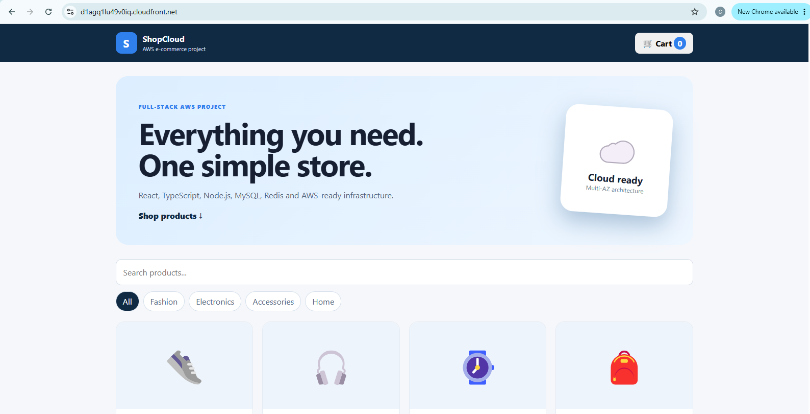
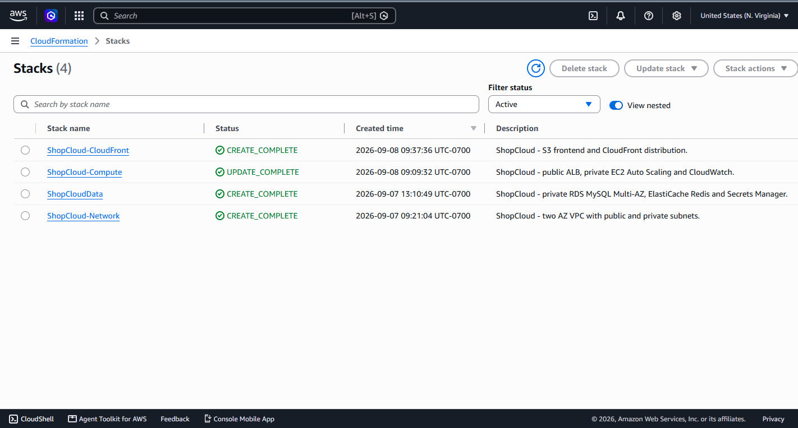
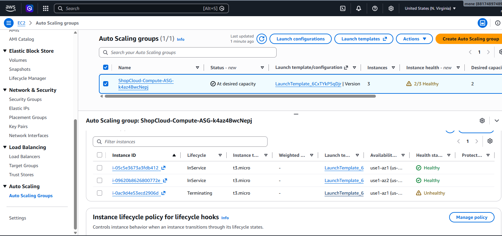
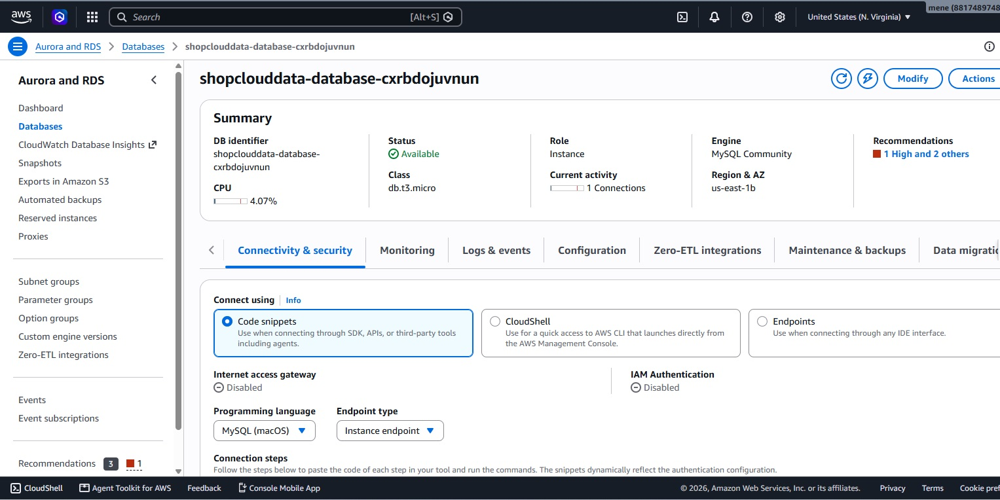
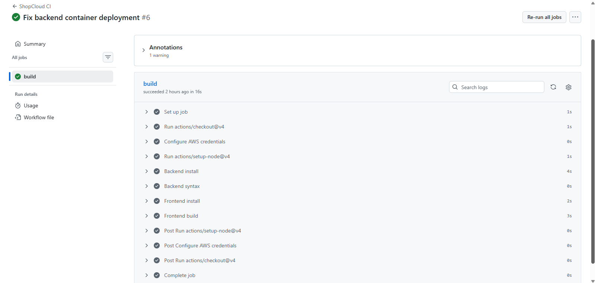

# ShopCloud

### High-Availability AWS E-Commerce Platform

ShopCloud is a full-stack e-commerce application deployed on Amazon Web Services (AWS).

The project demonstrates a production-style cloud architecture using containerized backend services, managed databases, caching, load balancing, auto scaling, CDN delivery, infrastructure as code, security controls, and continuous integration.

---

## 🚀 Live Demo

**Live Application:**  
https://d1agq1lu49v0iq.cloudfront.net/

The frontend is delivered through Amazon CloudFront, while API requests are routed to the backend through an Application Load Balancer.

---

## 🖥️ Application

ShopCloud provides an online shopping application with:

- Product listing
- Product data stored in MySQL
- REST API backend
- Redis caching
- React frontend
- Containerized backend
- Highly available AWS infrastructure

---

## 🛠️ Technology Stack

| Layer | Technology |
|---|---|
| Frontend | React, TypeScript, Vite |
| Backend | Node.js, Express |
| Database | Amazon RDS MySQL |
| Cache | Amazon ElastiCache Redis |
| Containers | Docker, Docker Compose |
| Container Registry | Amazon ECR |
| Infrastructure | AWS CloudFormation |
| Load Balancing | Application Load Balancer |
| Compute | Amazon EC2 |
| Scaling | EC2 Auto Scaling |
| Frontend Hosting | Amazon S3 |
| CDN | Amazon CloudFront |
| Secrets | AWS Secrets Manager |
| Monitoring | Amazon CloudWatch |
| CI | GitHub Actions |
| Version Control | Git, GitHub |

---

## ☁️ AWS Architecture

```text
                         INTERNET
                            |
                            v
                    +----------------+
                    |   CloudFront   |
                    +-------+--------+
                            |
                 +----------+----------+
                 |                     |
                 v                     v
          +-------------+       +-------------+
          |     S3      |       |     ALB     |
          |  Frontend   |       |   HTTP :80  |
          +-------------+       +------+------+
                                       |
                              +--------+--------+
                              |                 |
                              v                 v
                        +-----------+     +-----------+
                        |   EC2     |     |   EC2     |
                        |   App     |     |   App     |
                        +-----+-----+     +-----+-----+
                              |                 |
                              +--------+--------+
                                       |
                         +-------------+-------------+
                         |                           |
                         v                           v
                  +-------------+             +-------------+
                  | RDS MySQL   |             | ElastiCache |
                  |  Multi-AZ   |             |    Redis    |
                  +-------------+             +-------------+

                       AWS Secrets Manager
                               |
                               v
                       Database Credentials       


https://d1agq1lu49v0iq.cloudfront.net/

---

## 📸 Project Screenshots

### 🛒 Live Application



The deployed ShopCloud e-commerce application running through Amazon CloudFront.

### ☁️ AWS Architecture


High-availability AWS architecture showing CloudFront, S3, Application Load Balancer, EC2 Auto Scaling, Amazon RDS, ElastiCache Redis, and AWS Secrets Manager.

### 🏗️ CloudFormation Infrastructure



AWS CloudFormation stacks used to provision the ShopCloud infrastructure.

### ⚖️ Auto Scaling



EC2 Auto Scaling Group running application instances across multiple Availability Zones.

### 🗄️ Amazon RDS MySQL



Amazon RDS MySQL database used as the application's persistent data layer.

### 🔄 GitHub Actions CI



GitHub Actions workflow validating the backend and frontend builds.

### 🛍️ E-Commerce Architecture


Application architecture showing the major AWS services and application components.

---

## 📌 About the Project

ShopCloud was built as a hands-on AWS cloud engineering project to demonstrate the deployment of a full-stack application using highly available, scalable, and managed AWS services.

The project focuses on:

- Cloud infrastructure design
- Infrastructure as Code with AWS CloudFormation
- High availability across multiple Availability Zones
- Containerized backend deployment with Docker
- EC2 Auto Scaling
- Application Load Balancing
- Managed MySQL database with Amazon RDS
- Redis caching with Amazon ElastiCache
- Secure database credentials using AWS Secrets Manager
- Static frontend hosting with Amazon S3
- Global content delivery with Amazon CloudFront
- Container images with Amazon ECR
- Continuous Integration with GitHub Actions
- AWS networking and security groups

This project demonstrates practical cloud engineering concepts that can be applied to production-style web applications.